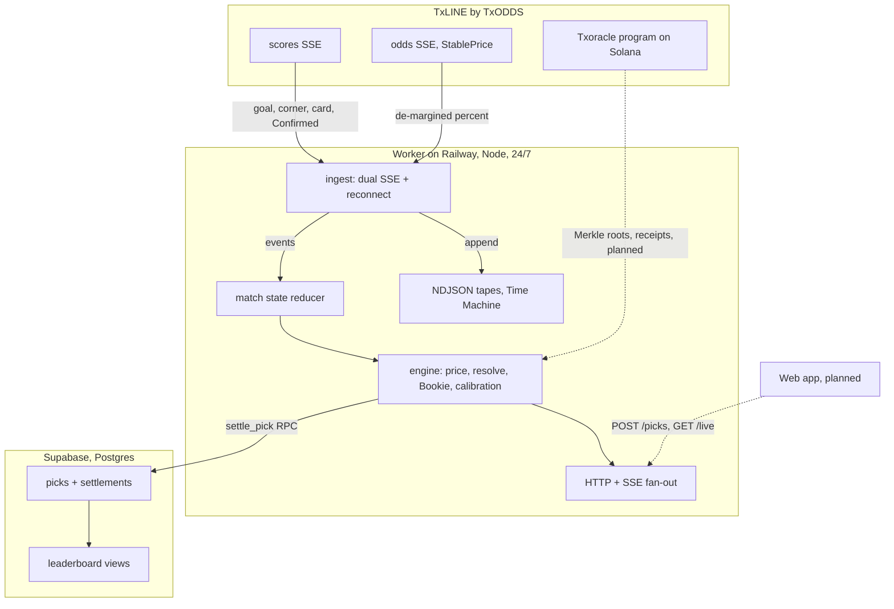

<p align="center">
  
</p>

<h1 align="center">CALLED IT</h1>

<p align="center">
  A free live prediction game for the 2026 World Cup, where every call is priced
  by the betting market's own de-margined probability.
</p>

A free live prediction game for the 2026 World Cup. You call short-window
outcomes during a match; each call is priced by the betting market's own
de-margined probability the instant you lock it, so a 12 percent call pays 833
points and an 85 percent one pays 118. You climb only by beating a ghost that
always backs the favorite.

Built for the TxODDS World Cup hackathon on Superteam Earn, Consumer and Fan
Experiences track.


<!--
Hero screenshot omitted on purpose: the player-facing web app is not built yet
(see "What is real and what is mocked"). Capture the hero once apps/web renders a
live match, at 1280 to 1600 px, and store it as docs/screenshots/01-match.png.
-->

## 🎯 The problem

Most fans watch the World Cup with a phone in hand, and the only way to turn
that second screen into a game is a prediction app that scores every pick the
same. Guessing a 9 percent upset counts for exactly as much as guessing the
1.2-favorite, so there is no reward for reading the match better than the crowd,
and no way to prove afterwards that you actually called it before the ball went
in.

The data that could fix this, a live consensus of what the whole betting market
believes second by second, has been locked inside the pricing desks of large
operators. TxLINE opens that feed. CALLED IT turns it into the scoring rule
itself.

## 🧭 What it does

- **Market-priced calls.** During a live match you lock short-window calls (a
  corner in the next ten minutes, a goal before half-time). Points for a hit are
  `round(100 / p)`, where `p` is the market's de-margined probability at lock
  time, capped at 2000. Following the crowd pays little; reading an upset pays a
  lot.
- **The Bookie, a ghost opponent.** Every call you make, a ghost named the
  Bookie makes the market-favorite version of. Your leaderboard metric is your
  margin over the Bookie, so you rise only by beating the market, not by picking
  safe.
- **A calibration profile.** Over many calls the app scores your edge against
  the market and your Brier score, and buckets your hits by confidence, so a
  player learns whether their reads are genuinely sharper than the line.
- **A latency HUD.** The app shows the measured time from the feed emitting an
  event to it reaching the screen, because a real-time claim should carry its
  own number.
- **Streaks.** Consecutive hits multiply the next hit by 1.1 each, up to 3.0x,
  and a miss resets the run.
- **Provable receipts (designed).** Each pick is meant to commit on Solana
  before its event resolves, so a win can be verified rather than screenshotted.
  See the honesty section for what is wired today.

## 🏗 How it works



The worker consumes both TxLINE streams as a single server-side subscriber and
fans results out, so a match is read once no matter how many clients watch. It
survives the feed misbehaving: reconnect with backoff, a 90 second stall
watchdog, and a shared refresh when the guest token expires mid-stream.
Settlement credits only events the feed marks `Confirmed`, so a VAR reversal
does not pay a call that was overturned. When a match ends the feed zeroes the
clock, so a finished-match sweep forces final verdicts rather than leaving picks
pending. If Supabase is absent the worker still runs, in memory, and logs that
state is not durable.

### The call model

| Call | Priced by | Settles when |
| --- | --- | --- |
| Corner in the next 10 min | Poisson model | a Confirmed corner lands in the window |
| Goal before half-time | Poisson model | a Confirmed goal lands in the window |
| A card in the next 15 min | Poisson model | a Confirmed yellow or red lands in the window |
| Underdog still alive at 80' | live StablePrice market | the underdog win probability at 80' clears the threshold |

Points are `round(100 / p)` capped at 2000; streaks multiply by 1.1 per
consecutive hit up to 3.0x. The Bookie ghost takes the market-favorite side of
each call and never uses streaks, so its score is the market's own baseline.

## ⚡ Live and measured

| Artifact | Where |
| --- | --- |
| Worker API | [worker-production-6555.up.railway.app/health](https://worker-production-6555.up.railway.app/health) |
| Mainnet subscription, Service Level 12 | [tx DnHr...5bGx](https://explorer.solana.com/tx/DnHrZaGbp8fd84hsGJa1EeTAkfHMjvjZUrpT6Ktb8K2Dk5rKz6LQSsXgLRnWVRtdX9VcCjTfKxtc3ajvMN75bGx) |
| TxLINE Txoracle program | [9Exb...cKaA](https://explorer.solana.com/address/9ExbZjAapQww1vfcisDmrngPinHTEfpjYRWMunJgcKaA) |

Evidence:

- The worker runs 24/7 on mainnet Service Level 12 (real-time). Its `/health`
  reports live latency measured over a rolling 200-sample window: scores near
  p50 153 ms and p95 169 ms, odds near p50 245 ms, from a San Francisco region.
- It records every tracked match to an NDJSON tape with no manual start, which
  is the fuel for the Time Machine replay.
- Settlement can say no: the committed test fixture (USA vs Bosnia) contains a
  VAR overturn, and the engine credits only the `Confirmed` final of 2 goals,
  not the intermediate state. See
  [packages/engine/src/replay.test.ts](packages/engine/src/replay.test.ts).

## 🧪 Reproduce it

Prerequisites: Node 22 or newer, pnpm 11.9.0.

```bash
pnpm install
cp .env.example .env
pnpm typecheck
pnpm --filter @calledit/engine test   # 42 tests
pnpm --filter @calledit/worker test   # 21 tests
```

Success: each command exits 0 with every assertion passing (42 and 21, checked
in this repo). No network or wallet is needed for the test suites; they run
against a committed capture of a real match.

To run the live worker you also need TxLINE access (a Solana wallet and an
on-chain subscription, see [spike/README.md](spike/README.md)) and, for durable
storage, a Supabase project. Then:

```bash
pnpm --filter @calledit/worker start   # serves on port 8787
```

## ⚠️ What is real and what is mocked

- **The web app is not built yet.** `apps/web` does not exist, so there are no
  screenshots. What runs today is the backend: the TxLINE client, the game
  engine, and a worker live on mainnet. The player interface (the "Stade de
  nuit" design) is the next milestone.
- **On-chain receipts are designed, not wired.** The verification primitive is
  real (TxLINE anchors daily Merkle roots on Solana and exposes a read-only
  `validateStat`), and the server holds a mainnet subscription, but CALLED IT's
  own pick commitment (a Merkle root posted through a Memo transaction) and the
  shareable receipt are not built yet.
- **Micro-event calls are model-priced, not market-quoted.** Corner, goal, and
  card windows are priced by a transparent Poisson model with documented
  per-minute rates in
  [packages/engine/src/catalog.ts](packages/engine/src/catalog.ts). Only the
  underdog call reads the live StablePrice market. Fitting the micro model to
  captured tapes is pending.
- **Guest identity only.** Players authenticate with a hashed guest token; there
  are no full accounts yet.
- **Time Machine records, playback is pending.** The worker writes a tape for
  every match; the replay that turns a tape back into a live-feeling match is
  not built.
- **Free-tier Supabase pauses after 7 idle days.** It has to be kept awake
  during the judging window in late July.

## 🔗 Prior art

- **FotMob and Superbru predictors**: pick outcomes for points, but scored on a
  flat rubric. CALLED IT prices every call by the live market instead.
- **Amazon Prime Vision Next Gen Stats**: probability-enriched viewing, but
  broadcast-only and not a game.
- **Sports betting apps**: real stakes and the gambling wall. CALLED IT is
  free-to-play with no stakes and no payouts.

## 📦 Repository layout

```
packages/txline/   typed TxLINE client: auth, REST, SSE streams
packages/engine/   pure game engine: pricing, calls, resolution, Bookie, calibration
apps/worker/       live worker: ingest, state, fan-out, tapes, game service
db/                Postgres schema (Supabase migration)
spike/             API access runbook and observation scripts
docs/              OpenAPI spec, API feedback, assets
```

Work in progress: `apps/web` (player interface) and the on-chain receipt
pipeline are the next milestones. This README describes what is built and runs
today, and flags the rest in the honesty section above.
