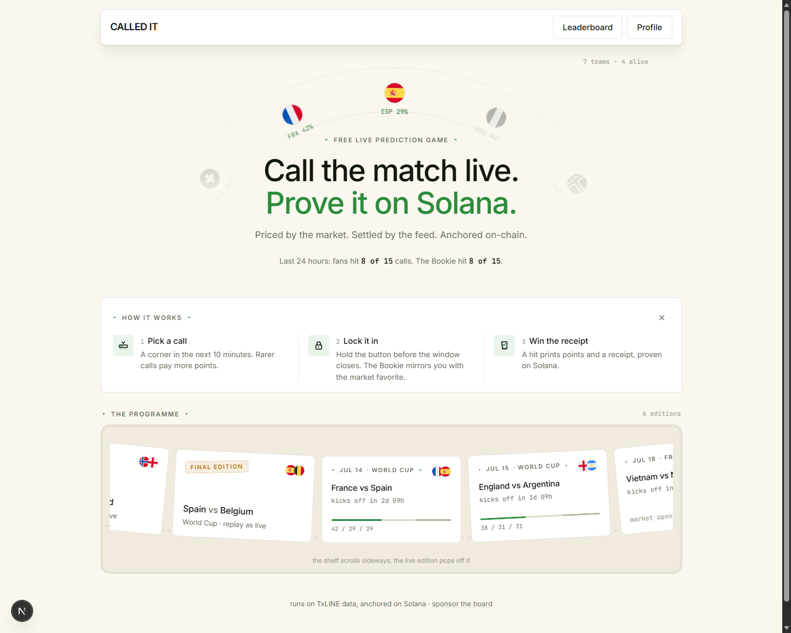
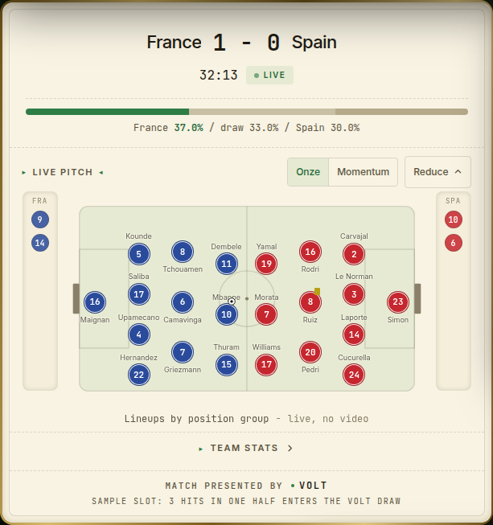
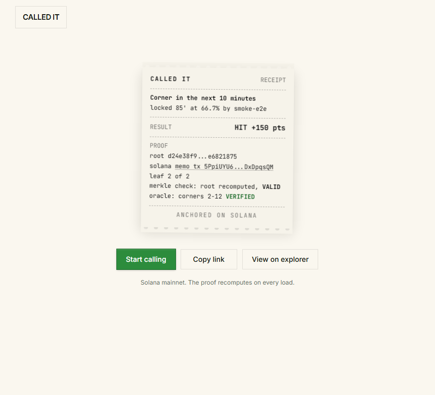
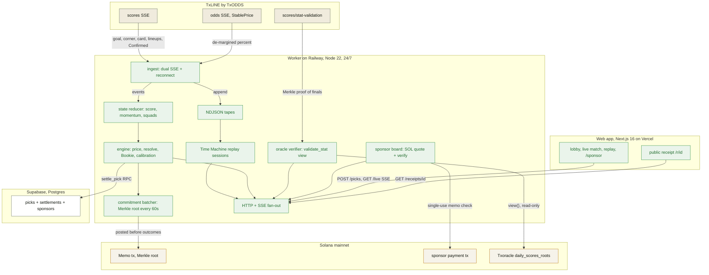

<p align="center">
  
</p>

<h1 align="center">CALLED IT</h1>

<p align="center">
  A free live prediction game for the 2026 World Cup where every call commits to
  Solana before its event resolves, so a win is verified on chain, not screenshotted.
</p>

Each call is priced by the betting market's own de-margined probability the instant
you lock it, so a 12 percent call pays 833 points and an 85 percent one pays 118. You
climb only by beating a ghost that always backs the favorite. Every locked pick is
Merkle-committed through a Solana memo transaction, so the receipt proves the call
existed before the ball went in.

Built for the TxODDS World Cup hackathon on Superteam Earn, Consumer and Fan
Experiences track.




| The living pitch: both elevens, benches, live stat badges           | The proof: merkle VALID, oracle VERIFIED, anchored on Solana        |
| ------------------------------------------------------------------- | ------------------------------------------------------------------- |
|          |                  |

## 🎯 The problem

Most fans watch the World Cup with a phone in hand, and the only way to turn that
second screen into a game is a prediction app that scores every pick the same.
Guessing a 9 percent upset counts for exactly as much as guessing the 1.2-favorite, so
there is no reward for reading the match better than the crowd, and no way to prove
afterwards that you actually called it before the ball went in.

The data that could fix this, a live consensus of what the whole betting market
believes second by second, has been locked inside the pricing desks of large
operators. TxLINE opens that feed. CALLED IT turns it into the scoring rule itself, and
anchors every pick on Solana so the proof survives the group chat.

## 🧭 What it does

- **Market-priced calls, locked by holding.** During a live match you lock
  short-window calls (a corner in the next ten minutes, a goal before half-time) with
  a 500 ms hold-to-lock gesture. Points for a hit are `round(100 / p)`, where `p` is
  the market's de-margined probability at lock time, capped at 2000. A quiet drain
  bar shows the window closing, and when a missed window's event lands within 300
  seconds of the deadline, an honest near-miss post-mortem prints the factual margin
  ("the corner came 87', window closed 85'").
- **The Bookie, a ghost opponent.** Every call you make, a ghost named the Bookie
  makes the market-favorite version of. Your metric is your margin over the Bookie,
  and the lobby's duel line tallies fans against the ghost over the last 24 hours.
- **Provable receipts, live on mainnet.** Each locked pick is hashed into a Merkle
  tree and its root is posted through a Solana memo transaction on a 60 second batch,
  before the event resolves. The public receipt at `/r/{pickId}` carries the memo
  transaction, the Merkle proof, a recomputed `proofValid` check, and, once TxODDS
  posts its daily root, an oracle line proving the settled final against the Txoracle
  program on chain. A receipt link unfurls in a group chat as a thermal-receipt card.
- **The living pitch.** At kickoff the printed pitch presents both starting elevens
  as jersey chips in the feed's real shirt colors, grouped in honest GK / DEF / MID /
  FWD lines (the feed's position groups, never an invented formation), with benches
  alongside. Substitutions swap players between pitch and bench, a red card grays the
  player in place, scorers wear a live ball badge, and every chip opens a player card
  with live counters and an attributed timeline ("115' Subbed on, 121' Goal"). A team
  stats view lists both full squads with counters updating in real time.
- **The Time Machine and the programme rail.** The worker tapes every match
  automatically; a finished match replays through the same state and game pipeline at
  1x, 10x, or 60x, with the same lock flow and settlements, session-scoped and off
  the official leaderboard. Finished editions sit on the lobby's curved programme
  rail with final scores read back from the tapes, under a tournament wheel that
  marks eliminated teams OUT and prices the survivors' next match live.
- **Three sponsorship surfaces.** A named match reskin (`?sponsor=` demo), a sponsor
  line on shared receipts, and a self-serve board: anyone can buy ticker time in SOL
  at `/sponsor`, priced by duration, tier, and demand; the worker builds the unsigned
  transfer and verifies the payment on chain (amount, recipient, single-use memo)
  before the name rides the header boards.
- **A measured skill profile.** Calibration buckets, edge versus the market, a Brier
  score, streaks that multiply the next hit by 1.1 up to 3.0x, and a latency HUD
  showing the measured feed-to-screen delay, because a real-time claim should carry
  its own number.

## 🏗 How it works



Beige, TxLINE inputs; green, CALLED IT services; white, Postgres; paper, Solana.

The worker consumes both TxLINE streams as a single server-side subscriber and fans
results out, so a match is read once no matter how many clients watch. It survives the
feed misbehaving: reconnect with backoff, a stall watchdog, and a shared refresh when
the guest token expires mid-stream. Settlement credits only events the feed marks
`Confirmed`, so a VAR reversal does not pay a call that was overturned. When a match
ends the feed zeroes the clock, so a finished-match sweep forces final verdicts rather
than leaving picks pending. The commitment batcher tolerates a failed memo: it records
nothing for that batch and retries, so a pick is never marked committed without a real
transaction. Oracle verification failing never breaks a receipt: the oracle line
renders a distinct `pending` or `unavailable` status instead. A sponsor payment that
cannot be verified on chain activates nothing, and a transaction signature is
single-use by unique index, so a paid slot cannot be replayed. When a tape predates
the feed's lineups records, every squad surface stays absent instead of rendering an
empty shell. If Supabase is absent the worker still runs, in memory, and logs that
state is not durable.

### The call model

| Call | Priced by | Settles when |
| --- | --- | --- |
| Corner in the next 10 min | Poisson model, 0.11 per min | a Confirmed corner lands in the window |
| Goal before half-time | Poisson model, 0.03 per min | a Confirmed goal lands in the window |
| A card in the next 15 min | Poisson model, 0.044 per min | a Confirmed yellow or red lands in the window |
| Underdog still alive at 80' | live StablePrice market | the underdog win probability at 80' clears 15 percent |

Points are `round(100 / p)` capped at 2000; streaks multiply by 1.1 per consecutive
hit up to 3.0x. The Bookie ghost takes the market-favorite side of each call and never
uses streaks, so its score is the market's own baseline.

## ⚡ Live and measured

| Artifact | Where |
| --- | --- |
| Live app | [called-it-web-murex.vercel.app](https://called-it-web-murex.vercel.app) |
| Proven receipt, merkle VALID + oracle VERIFIED | [/r/836a7729...](https://called-it-web-murex.vercel.app/r/836a7729-6ae0-4139-9248-5b79cfb87de1) |
| Self-serve sponsor board, priced in SOL | [/sponsor](https://called-it-web-murex.vercel.app/sponsor) |
| Worker API, live health | [worker-production-6555.up.railway.app/health](https://worker-production-6555.up.railway.app/health) |
| Proven pick, memo transaction | [tx 5Ppi...pqsQM](https://explorer.solana.com/tx/5PpiUYU6WgsfsN1cDwntTxK9XaWcdg5b1fZd5b2kRA3F8KQwMnXLE8GSaU9eoNMKjrGAcbGudEQLX54qDxDpqsQM) |
| Mainnet subscription, Service Level 12 | [tx DnHr...5bGx](https://explorer.solana.com/tx/DnHrZaGbp8fd84hsGJa1EeTAkfHMjvjZUrpT6Ktb8K2Dk5rKz6LQSsXgLRnWVRtdX9VcCjTfKxtc3ajvMN75bGx) |
| TxLINE Txoracle program | [9Exb...cKaA](https://explorer.solana.com/address/9ExbZjAapQww1vfcisDmrngPinHTEfpjYRWMunJgcKaA) |

Evidence:

- **The full loop ran on mainnet during a live match.** A real pick was locked during
  Paraguay vs France, settled on a Confirmed corner for +150 points, and committed on
  chain. The memo transaction above is `finalized` with no error, and the public
  receipt recomputes its Merkle proof to `proofValid: true`.
- **The settled outcome is proven against TxODDS's own on-chain root.** The same
  receipt carries `oracle: corners 2-12 VERIFIED`: the worker fetched the
  stat-validation Merkle proof and `Txoracle.validate_stat(...).view()` confirmed it
  against the `daily_scores_roots` account. The negative control holds too: the same
  call with the value shifted by one returns false (runbook in
  [spike/src/08-stat-validation.ts](spike/src/08-stat-validation.ts)).
- **The worker runs 24/7 on Service Level 12 (real-time).** A `/health` sample during
  a live match reported scores latency p50 149 ms and p95 170 ms over a rolling
  200-sample window from a San Francisco region. The endpoint is live; read it for
  the current numbers.
- **Settlement can say no.** The committed test fixture (USA vs Bosnia) contains a
  VAR overturn, and the engine credits only the `Confirmed` final of 2 goals, not the
  intermediate state. See
  [packages/engine/src/replay.test.ts](packages/engine/src/replay.test.ts).

## 🧪 Reproduce it

Prerequisites: Node 22 or newer, pnpm 11.9.0.

```bash
pnpm install
cp .env.example .env
pnpm -r run typecheck
pnpm --filter @calledit/engine test   # 50 tests
pnpm --filter @calledit/worker test   # 83 tests
```

Success: each command exits 0 with every assertion passing (50 and 83, checked in
this session). No network or wallet is needed for the test suites; they run against
committed captures of real matches.

To run the player interface against the live worker:

```bash
pnpm --filter @calledit/web dev       # serves on http://localhost:3000
```

To run the live worker yourself you also need TxLINE access (a Solana wallet and an
on-chain subscription, see [spike/README.md](spike/README.md)) and, for durable
storage, a Supabase project. Then:

```bash
pnpm --filter @calledit/worker start  # serves on port 8787
```

## ⚠️ What is real and what is mocked

- **Micro-event calls are model-priced, not market-quoted.** Corner, goal, and card
  windows are priced by a transparent Poisson model with documented per-minute rates
  in [packages/engine/src/catalog.ts](packages/engine/src/catalog.ts). Only the
  underdog call reads the live StablePrice market. Fitting the micro model to
  captured tapes is pending.
- **The sponsor board's first real purchase is pending.** The whole mechanic is
  deployed and unit-tested: quotes, the unsigned transfer built by the worker, and
  on-chain verification of amount, recipient, and a single-use memo. No third party
  has paid for a slot yet. The "Volt" name on match screens is a demo reskin driven
  by the `?sponsor=` parameter, and the jackpot line under it is a labeled sample
  slot, not a real prize.
- **Player data goes exactly as far as the feed does.** Lineups carry names, shirt
  numbers, and position groups, so the pitch shows group lines, never a tactical
  formation. The feed attributes goals, cards, substitutions, and injuries to
  players; it never says who has the ball or who takes a corner, and it serves no
  photos, so players are printed roundels. Tapes recorded before TxLINE added
  lineups have no squad surfaces at all.
- **The oracle line depends on TxODDS's posting cadence.** The daily root for a match
  day appears hours after full time, so a fresh receipt shows `oracle: proof pending`
  on match night and `VERIFIED` the next day. Model-priced calls have no on-chain
  stat to prove and say so with a distinct status.
- **The hero receipt predates the fixture-name cache.** The mainnet fixtures window
  is future-only, so the proven Paraguay vs France receipt shows no team names; picks
  locked since 2026-07-10 carry them.
- **Identity is guest-first; the wallet link is optional recovery.** Players get a
  hashed guest token in the browser; linking a Solana wallet (a signed single-use
  challenge, never a transaction) lets a profile be restored on another device.
  Losing the token with no linked wallet means starting a new player.
- **Replay sessions are in-memory.** A Time Machine session (cap 6 concurrent, 30
  minute idle timeout) disappears on worker restart; the tapes themselves are durable
  on a volume, and final scores on the lobby rail are read from those tapes.
- **Free-tier Supabase pauses after 7 idle days.** A daily worker heartbeat keeps it
  awake through the judging window in late July.

## 🔗 Prior art

- **FotMob and Superbru predictors**: pick outcomes for points, but scored on a flat
  rubric. CALLED IT prices every call by the live market instead.
- **Amazon Prime Vision Next Gen Stats**: probability-enriched viewing, but
  broadcast-only and not a game.
- **Sports betting apps**: real stakes and the gambling wall. CALLED IT is
  free-to-play with no stakes and no payouts, which is also why it needs no gambling
  license (no consideration, no prize purchase).

## 📦 Repository layout

```
packages/txline/     typed TxLINE client: auth, REST, SSE streams
packages/engine/     pure game engine: pricing, calls, resolution, Bookie, calibration
packages/contracts/  shared wire types between worker and web
apps/worker/         live worker: ingest, state, fan-out, tapes, commitments, sponsors, game service
apps/web/            Next.js player interface: lobby, live match, replay, receipt, sponsor board
db/                  Postgres schema (Supabase migrations)
spike/               API access runbook, observation scripts, mainnet IDL
docs/                OpenAPI spec, API feedback, design system, technical brief, assets
```

Next milestones: the demo video and the submission page. Everything else described
here is built, tested, and running in production; the technical brief lives at
[docs/TECH_DOC.md](docs/TECH_DOC.md) and the API feedback at
[docs/FEEDBACK.md](docs/FEEDBACK.md).
