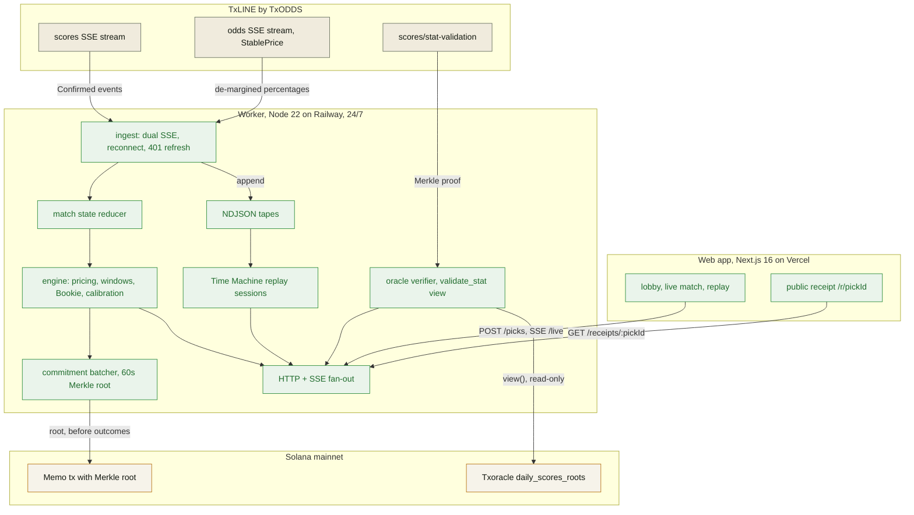

# CALLED IT: technical brief

The submission tech doc for the TxODDS World Cup Hackathon (Consumer and Fan
Experiences track). Core idea, architecture, the exact TxLINE endpoints used,
the Solana integrations, and the business path, on one page.

| Deliverable | Where |
| --- | --- |
| Live app | [called-it-web-murex.vercel.app](https://called-it-web-murex.vercel.app) |
| Live API | [worker-production-6555.up.railway.app/health](https://worker-production-6555.up.railway.app/health) |
| Public repo | [github.com/Andy00L/called-it](https://github.com/Andy00L/called-it) |
| API feedback | [docs/FEEDBACK.md](FEEDBACK.md) |

## 🎯 Core idea

CALLED IT is a free live prediction game for the 2026 World Cup where the
betting market itself is the scoring rule and every call is provable on
Solana. During a live match a fan locks short-window calls (a corner in the
next 10 minutes, a goal before half-time). A hit pays `round(100 / p)` points,
capped at 2000, where `p` is the de-margined market probability at the moment
of the lock, so calling a 12 percent upset pays 833 and following the crowd
pays little. Consecutive hits multiply the next one by 1.1, up to 3.0x.

Two mechanisms make it more than a quiz:

- **The Bookie.** A ghost opponent mirrors every human call with the market
  favorite. The leaderboard question is not "did you guess", it is "did you
  beat the market". A calibration profile (edge vs market, Brier score,
  confidence buckets) tells each player whether their reads are real.
- **Receipts, anchored before the outcome.** Every locked pick is hashed into
  a Merkle tree whose root posts to Solana in a Memo transaction on a 60
  second batch, before the event resolves. The public receipt page recomputes
  the Merkle proof and, once TxODDS publishes its daily root, cross-checks
  the settled final against the Txoracle program on-chain. A win is a
  verifiable object, not a screenshot.

Because judging happens after the final, the app ships a **Time Machine**:
the worker records every match feed to a tape, and a finished match can be
replayed through the same engine at 1x, 10x, or 60x, with the same lock flow
and settlements (replay scores never touch the official leaderboard).

## 🏗 Architecture

Beige, TxLINE inputs; green, CALLED IT services; paper, Solana.

Failure paths are engineered, not hoped away: settlement credits only events
the feed marks `Confirmed`, so a VAR overturn cannot pay a dead call; a failed
memo posts nothing and retries, so no pick is ever marked committed without a
real transaction; oracle verification failing leaves the receipt intact with a
distinct `pending` or `unavailable` status; if Supabase is unreachable the
worker degrades to in-memory persistence and says so in its logs.

## 🔗 TxLINE endpoints used

Live product inputs (running 24/7 on mainnet Service Level 12, real-time):

| Endpoint | Role in CALLED IT |
| --- | --- |
| `POST {origin}/auth/guest/start` | guest JWT (re-acquired automatically on 401) |
| `POST /api/token/activate` | API token from the on-chain subscription + wallet signature |
| `GET /api/fixtures/snapshot` | fixture catalog and team names (30 day forward window) |
| `GET /api/scores/stream` (SSE) | every match event; `Confirmed` drives all settlements |
| `GET /api/odds/stream` (SSE) | StablePrice de-margined probabilities; prices every call |
| `GET /api/scores/stat-validation` | Merkle proofs of final stats, fed into on-chain verification |

Research and verification tooling (spike runbooks, committed):

| Endpoint | Used for |
| --- | --- |
| `GET /api/odds/snapshot/{fixtureId}`, `GET /api/odds/updates/{fixtureId}` | market shape study, model rates |
| `GET /api/scores/snapshot/{fixtureId}`, `GET /api/scores/updates/{fixtureId}` | schema ground truth, finals extraction |
| `GET /api/scores/historical/{fixtureId}` | replay research (devnet serializer bug reported in FEEDBACK.md) |

## ⛓ Solana integrations

| Integration | Mechanism | Proof |
| --- | --- | --- |
| TxLINE subscription | Anchor `subscribe(serviceLevelId, weeks)` to Service Level 12 | [tx DnHr...5bGx](https://explorer.solana.com/tx/DnHrZaGbp8fd84hsGJa1EeTAkfHMjvjZUrpT6Ktb8K2Dk5rKz6LQSsXgLRnWVRtdX9VcCjTfKxtc3ajvMN75bGx) |
| Pick commitments | Merkle root of each 60s pick batch in a Memo tx, posted before outcomes; receipts carry the inclusion proof and recompute it | [tx 5Ppi...pqsQM](https://explorer.solana.com/tx/5PpiUYU6WgsfsN1cDwntTxK9XaWcdg5b1fZd5b2kRA3F8KQwMnXLE8GSaU9eoNMKjrGAcbGudEQLX54qDxDpqsQM) |
| Outcome verification | `Txoracle.validate_stat(...).view()` (read-only, free) checks settled finals against the `daily_scores_roots` PDA | [program 9Exb...cKaA](https://explorer.solana.com/address/9ExbZjAapQww1vfcisDmrngPinHTEfpjYRWMunJgcKaA) |

The chain of custody a judge can click: the receipt shows the pick, its lock
time and probability, the memo transaction that anchored it before the event,
the recomputed Merkle check, and the oracle line proving the final stat
against TxODDS's own on-chain root. Example:
[a real pick from live Paraguay vs France](https://called-it-web-murex.vercel.app/r/836a7729-6ae0-4139-9248-5b79cfb87de1),
settled +150 on a confirmed corner, merkle VALID, oracle VERIFIED (corners
2-12).

## ⚡ Technical highlights

- **One subscriber, many fans.** The worker reads each TxLINE stream once and
  fans out over SSE; the app shows a latency HUD with measured last/p50/p95
  feed latency (odds p50 around 245 ms from the Railway region; live scores
  events typically land on screen in well under a second).
- **VAR-safe settlement.** Only `Confirmed` events settle; the committed test
  fixture (USA vs Bosnia) contains a VAR overturn the engine must not pay
  early.
- **Time Machine.** Tapes record automatically for every tracked match;
  replay sessions push them through the same state and game pipeline at 1x,
  10x, or 60x, capped at 6 concurrent sessions with a 30 minute idle TTL, and
  fast-forward the pre-match head so a viewer lands at kickoff.
- **117 tests** (48 engine, 69 worker) run against committed captures of real
  matches, no network needed.
- **Free-to-play by design.** No wallet, no signup: two taps from lobby to a
  locked call under a guest identity. The chain work happens server-side.

## 💼 Business model and monetization path

CALLED IT is the free engagement layer that makes market data emotional: every
fan gets a skin-in-the-game feeling with zero stakes, and every win becomes a
shareable, provable receipt (links unfurl as thermal-receipt cards).

### Three ad surfaces, live in the product today

| Surface | Who buys it | Why it works | Working precedent |
| --- | --- | --- | --- |
| Pitchside board ("Match presented by") on the match cockpit | Consumer brands, per match or per territory | The frame around the screen fans watch at the emotional peak; football fans are conditioned to perimeter branding | Virtual perimeter ads are sold per match and per territory today (Bundesliga regional feeds, La Liga digital board replacement) |
| Sponsored call category ("Presented by" on the corner call) | A brand buying a named in-match moment | Attention at the tensest minutes plus a fan action tied to the name | FIFA sells this exact unit at WC2026: the Lay's Chip Challenge prediction game; Michelob ULTRA bought the Player of the Match vote for all 104 matches |
| The shared receipt and its public page `/r/{pickId}` | The match sponsor, priced as earned media | The sponsor line travels in group chats with every shared win, delivered off-platform by the fan | Sponsor-branded shareable moments (Budweiser's 2022 Player of the Match vote drove 10.8M social actions) |

The demo shows one sample brand (Volt) on all three surfaces, and proves the
slot is productized: `?sponsor=<brand>` on any match, replay, or receipt page
reskins every surface live. The slot is the product, not the logo: every
surface a bookmaker cannot legally give a fan, a free game can. Two more
mechanisms ride the same rails:

- **Sponsor-funded jackpot moments.** The board shows a sample slot ("3 hits
  in one half enters the draw"); in production a sponsor funds the headline
  prize and a prize-indemnity insurer carries the tail risk for a fixed
  premium, the standard structure behind ESPN Streak's $1M grand prize
  (sponsored by Progressive) and Chalkline's SCA-backed promotions.
- **Aggregate sentiment data.** The lobby's fans-versus-Bookie line (fans hit
  X of Y calls in the last 24 hours) is the visible corner of a crowd-vs-market
  index sponsors and media can buy, aggregate and anonymous only.

### Why free-to-play is the moat, not the compromise

Gambling regulation hinges on the prize-chance-consideration test: remove
consideration (nothing paid, nothing staked) and the game is a promotion, not
wagering; the UK Gambling Commission states that free prize competitions run
within the Gambling Act 2005 rules need no licence. ESPN's Streak ran as a
free game from 2008 to 2022 paying cash prizes under sweepstakes rules, and
FIFA's own Match Predictor runs globally the same way. The commercial
consequence: a real-money product's market is its licence map, while a free
game's market is every fan with a phone on day one. FanDuel's executives
describe free-to-play as their route to the half of the US where they cannot
legally operate. CALLED IT starts where the betting apps legally cannot.

### The ladder above the surfaces

1. **Tournament sponsorship package.** One brand buys the theming, the three
   surfaces, and aggregate audience insight for a whole tournament; Superbru
   has sold exactly this bundle (Heineken, DHL) around its free predictors
   since 2006.
2. **B2B white-label.** The live-call engine, Bookie duel, and receipt chain
   licensed to broadcasters and regulated operators as an acquisition and
   retention funnel. Companies run on this model today: Low6 (Flutter's
   Sportsbet, NFL teams), Chalkline (TwinSpires, JACK Entertainment),
   Monterosa (ITV's World Cup predictor). TxLINE supplies the data; CALLED IT
   supplies the engine.
3. **Cosmetic-only consumer layer.** Receipt papers, stamps, and profile
   flair: identity goods, the purchase motive the games research actually
   supports. Never extra calls, never better prices, never a paid edge.
4. **A consumer showcase for TxODDS.** The game demonstrates StablePrice and
   the oracle chain to a mainstream audience, the exact audience the data was
   never able to reach.

### Fan-first rules the design keeps on purpose

The engagement literature documents how real-money products manufacture
compulsion; CALLED IT is built as the counter-example, and that is a selling
point, not a constraint:

- Celebrations fire only on true hits; a miss renders flat and quiet. Slot
  UIs celebrate net losses ("losses disguised as wins", Dixon et al. 2010);
  this product never does.
- The near miss is printed factually: when a missed window's event lands just
  late, the toast and the receipt show the feed's own margin ("the corner
  came 87', window closed 85'"). Slot machines manufacture near-misses on
  purpose (Reid 1986); this product only ever reports one.
- Locking is a deliberate press-and-hold, never an accidental tap: personally
  arranging the call is what makes it rewarding (Clark et al. 2009), and
  keyboard users keep instant activation.
- The lock window is a real market constraint rendered calmly: a quiet 2 px
  bar drains with the actual window, no counters, no flashing, no
  manufactured panic (fake urgency is among the most common documented dark
  patterns, Mathur et al. 2019).
- The match bounds the session: half-time and full-time are natural stopping
  points, the inversion of "time on device" design (Schüll 2012).
- Everyone faces the same market. Selling edge is the fastest documented
  trust-killer in games monetization (King and Delfabbro 2018; Petrovskaya
  and Zendle 2021), so nothing purchasable ever touches pricing.
- No loss-chasing prompts after a miss: neutral copy, next natural call.
- The whole loop teaches itself in three steps ("How it works" strip), one
  concept per step, verb-first labels: cognitive load research (Sweller) and
  the Apple HIG onboarding guidance applied to a 10-second read.

Compliance posture: no stakes, no payouts, no odds displayed in betting
format; points only (the UI says "+150 pts", never a bare "+150"). That keeps
the product outside gambling regulation in most jurisdictions while
preserving the thrill of being right.
